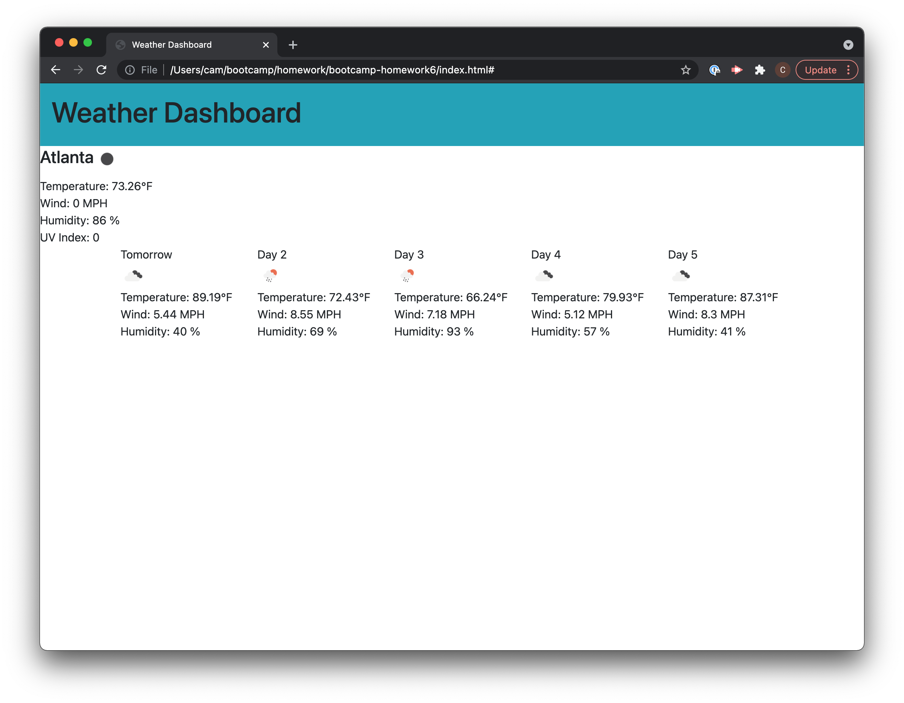

# bootcamp-homework6
Weather dashboard for multiple cities

This application allows a user to view weather data in a list of user generated cities. It displays the current weather for a city, as well as the 5 day forecast for the city. Users may search for a city to add it to the sidebar, and select cities from the sidebar.

The application can be found [here](https://caaam.github.io/bootcamp-homework6/).